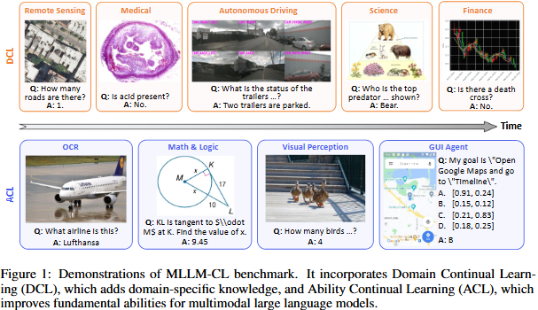
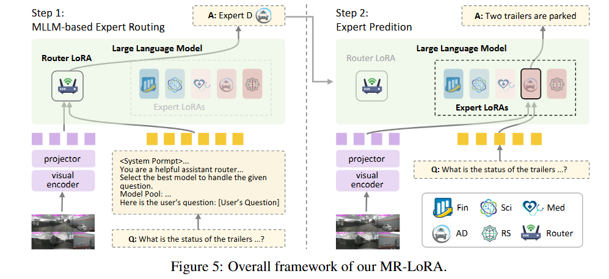

# MLLM-CL: Continual Learning for Multimodal Large Language Models

<!-- @import "[TOC]" {cmd="toc" depthFrom=1 depthTo=6 orderedList=false} -->

<!-- code_chunk_output -->

- [MLLM-CL: Continual Learning for Multimodal Large Language Models](#mllm-cl-continual-learning-for-multimodal-large-language-models)
  - [MLLM-CL Benchmark](#mllm-cl-benchmark)
    - [Domain Continual Learning](#domain-continual-learning)
    - [Ability Continual Learning](#ability-continual-learning)
  - [MR-LoRA](#mr-lora)
  - [Installation](#installation)
  - [Dataset](#dataset)
  - [MR-LoRA training and evaluation](#mr-lora-training-and-evaluation)
  - [Open Source Weights](#open-source-weights)
  - [Citation](#citation)
  - [Acknowledgement](#acknowledgement)
  - [LICENSE](#license)
  - [Contact](#contact)
  - [About us: MLLM-CL Community](#about-us-mllm-cl-community)

<!-- /code_chunk_output -->

This is the official repo of MLLM-CL and MR-LoRA. MLLM-CL is a novel benchmark encompassing domain and ability continual learning, where the former focuses on independently and identically distributed (IID) evaluation across evolving mainstream domains, whereas the latter evaluates on non-IID scenarios with emerging model ability. MR-LoRA prevents catastrophic interference through parameter isolation and an MLLM-based routing mechanism. For more details, please refer to: 

**MLLM-CL: Continual Learning for Multimodal Large Language Models** [[paper](https://arxiv.org/abs/2506.05453)].

[‪Hongbo Zhao](https://scholar.google.com/citations?user=Gs22F0UAAAAJ&hl=zh-CN), [Fei Zhu](https://impression2805.github.io/), [Haiyang Guo](https://ghy0501.github.io/guohaiyang0501.github.io/), [Meng Wang](https://moenupa.github.io/), Rundong Wang, [‪Gaofeng Meng](https://scholar.google.com/citations?hl=zh-CN&user=5hti_r0AAAAJ), [‪Zhaoxiang Zhang‬](https://scholar.google.com/citations?hl=zh-CN&user=qxWfV6cAAAAJ)


## MLLM-CL Benchmark
MLLM-CL is a benchmark for continual learning in multimodal large language models (MLLMs). It consists of two main components: domain continual learning and ability continual learning. The benchmark includes a variety of datasets and tasks to evaluate the performance of MLLMs in evolving scenarios.
### Domain Continual Learning
Continually adding domain knowledge is crucial for constructing a powerful MLLM.

To achieve this goal, we propose domain continual learning and choose five mainstream and common domains: remote sensing, medical, science, autonomous driving and finance.
In domain continual learning, the training set and test set are IID.
### Ability Continual Learning
Domain continual learning assumes that training and test data are IID.
However, achieving IID between training and test sets is often challenging in real-world scenarios.
In ability continual learning, we assume that the training and test data are non-IID.

We select four fundamental abilities for the MLLM to learn sequentially: OCR, math \& logic, visual perception and GUI agent.

## MR-LoRA

Our MR-LoRA performs two-stage inference for a given multimodal input, consisting of a routing phase followed by a prediction phase. In the first stage, the expert selection router is performed to select a domain or ability-specific expert. Then, the selected expert is combined with the pre-trained backbone to output the final response.

## Installation
1. Clone this repository and navigate to MLLM-CL folder
``` 
git clone https://github.com/bjzhb666/MLLM-CL.git
cd MLLM-CL
```
2. Install Package
```
pip install -e .
```

3. Install additional packages for training cases
```
pip install -e ".[train]" -i https://mirrors.tuna.tsinghua.edu.cn/pypi/web/simple
conda install git
pip install flash-attn==2.7.0.post2 --no-build-isolation -i https://mirrors.tuna.tsinghua.edu.cn/pypi/web/simple

huggingface-cli download liuhaotian/llava-v1.5-7b --local-dir checkpoints/LLaVA/Vicuna/llava-7b-v1.5
huggingface-cli download openai/clip-vit-large-patch14-336 --local-dir checkpoints/LLaVA/clip-vit-large-patch14-336
```
4. Prepare the API key
The evaluation of Math & Logic tasks requires the OpenAI API key.
Create an `.env` file in the root directory of the project and add your OpenAI API key:
```
# .env file
# QwenVL APIs
DASHSCOPE_API_KEY=
# Gemini w. Google Cloud Backends
GOOGLE_API_KEY=
# OpenAI API
OPENAI_API_KEY=YOUR_OPENAI_API_KEY
OPENAI_API_BASE=
LMUData=/data/hongbo_zhao/code/VLMEvalKit/LMUData
```

## Dataset
Please download the images of MLLM-CL from huggingface or modelscope: [[huggingface](https://huggingface.co/datasets/MLLM-CL/MLLM-CL)] or
[[modelscope](https://www.modelscope.cn/datasets/MLLM-CL/MLLM-CL)].

After downloading all of them, organize the data as follows:

Domain Continual Learning Data:
```
├── RS
│   └── images
|   └──train.json
|   └──test.json
├── Med
│   └── images
|   └──train.json
|   └──test.json
├── AD
│   └── images
|   └──train.json
|   └──test.json
├── Fin
│   └── images
│   └── test.sjon
│   └── train.json
├── Sci
|   └── images
|   └──train.json
|   └──test.json
```
Ability Continual Learning Data:
```
├── OCR
|   └── images
|   └──train.json
├── OCR_test
|   └── images
|   └──test.json
├── Math
|   └── images
|   └──train.json
├── Math_test
|   └── images
|   └──test.json
├── APP
|   └── images
|   └──train.json
├── APP_test
|   └── images
|   └──test.json
├── VP
|   └── images
|   └──train.json
├── VP_test
|   └── images
|   └──test.json
```

Note: You need to modify the data path in all the scripts to your own path.


## MR-LoRA training and evaluation
All the configs are in the `configs` folder.s
We provide the scripts of our train order in `scripts/Train`.

1. Modify the configs in the `configs` folder. You should modify the data_configs and model_configs.
2. Train the expert LoRA independently using the scripts in Train_dom_single folder or Train_ability_single folder. Then you should use checkpoints of LoRA to get cross-task evaluation results. For example, in domain continual learning, you should test 25 times. You can directly the following command to train the experts and get the cross-task evaluation results.
```
bash scripts/Train/train_DCL.sh 
```
3. Train the router LoRA
Before training the router LoRA, you should modify the configs about the router (`data_configs_router, model_configs_router`). Then use the command to train the router LoRA. You can get the router training data and replay data in [huggingface](https://huggingface.co/datasets/MLLM-CL/MLLM-CL-ReplayData) or [modelscope](https://www.modelscope.cn/datasets/MLLM-CL/mllmcl-replaydata).
```
bash scripts/Train/train_DCL_router.sh
```
4. Transfer the cross-task results to the desired format `M_N` where M is the model name and N is the dataset name. You can refer to the detailed usage is `mrlora_result_link.py`.
```
python scripts/mrlora_result_link.py [your_cross_result_path]
```
5. Use the router LoRA to select the final results, you should first modify some path in `Eval_MR_LoRA/eval_use_router_DCL`. 
```
bash scripts/Eval_MR_LoRA/eval_use_router_DCL.sh Med
bash scripts/Eval_MR_LoRA/eval_use_router_DCL.sh AD
bash scripts/Eval_MR_LoRA/eval_use_router_DCL.sh Sci
bash scripts/Eval_MR_LoRA/eval_use_router_DCL.sh Fin
bash scripts/Eval_MR_LoRA/eval_use_router_DCL.sh RS
```

Note: For the GUI agent task in ability continual learning, the final results are in a tsv file and you should submit it to the [evaluation server](https://eval.ai/web/challenges/challenge-page/2328/overview). The evaluation server will return the final results.


## Open Source Weights
We provide all the open source weights of MR-LoRA in huggingface and modelscope. You can download them from the following links.

| Type | Huggingface | ModelScope |
| ----- | ----- | ----- |
| Expert LoRA | [Huggingface](https://huggingface.co/MLLM-CL/MRLoRA_Experts) | [ModelScope](https://www.modelscope.cn/models/MLLM-CL/MRLoRA_Experts) |
| Router LoRA | [Huggingface](https://huggingface.co/MLLM-CL/MRLoRA_Router) | [ModelScope](https://www.modelscope.cn/models/MLLM-CL/MRLoRA_Router) |


## Citation
```
@article{zhao2025mllm,
  title={MLLM-CL: Continual Learning for Multimodal Large Language Models},
  author={Zhao, Hongbo and Zhu, Fei and Guo, Haiyang and Wang, Meng and Wang, Rundong and Meng, Gaofeng and Zhang, Zhaoxiang},
  journal={arXiv preprint arXiv:2506.05453},
  year={2025}
}
```

## Acknowledgement
[LLaVA](https://github.com/haotian-liu/LLaVA): the codebase we built upon, and our base model LLaVA-1.5-7b that has the amazing vision-language capabilities!

[MCITlib](https://github.com/Ghy0501/MCITlib): the codebase we train all our baselines on. MR-LoRA will be in this codebase in the future version.

[CoIN](https://github.com/zackschen/CoIN), [VLMEvalKit](https://github.com/open-compass/VLMEvalKit): the codebase we built upon.


## LICENSE
```
This project is licensed under the terms of the Apache-2.0 license.
```

## Contact
Please contact us or post an issue if you have any questions.

## About us: MLLM-CL Community
We are the members from [MLLM-CL(hf)](https://huggingface.co/MLLM-CL), [MLLM-CL(modelscope)](https://www.modelscope.cn/organization/MLLM-CL), an open-source community focus on Continual learning of Multimodal Large Language Models. 
We aim to construct a continuously evolving multimodal large language model (MLLM) system.
If you are interested in our community and want to join us, feel free to contact us on GitHub or by email.
- We are looking for contributors, collaborators and partners to build a better MLLM-CL community.
- We are also looking for sponsors to support our community and projects. If you are interested in sponsoring us, please contact us.
